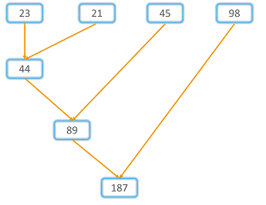

# Higher Order Function

Higher order functions are functions which take other function as a parameter or return a function as a value. The function passed as a parameter is called callback.

### Callback

A callback is a function which can be passed as parameter to other function. See the example below.

```js
// Callback
const myCallback = (n) => {
   return n ** 2;
};

console.log(myCallback(4)); //  16

function cube(myCallback, n) {
   return myCallback(n) * n; // cube = n*n*n,
}

console.log(cube(myCallback, 5)); // 125
```

### Returning Function

Higher order functions return function as a value.

```js
// Higher order function returning an other functions
const higherOrder = (a) => {
   const subHigher = (b) => {
      const sub = (c) => {
         return a + b + c;
      };
      return sub;
   };
   return subHigher;
};

console.log(higherOrder(1)(2)(3)); // 6
```

In above example, `sub` and `subHigher` are the functions.

Lets us see where we use call back functions. For instance the _forEach_ method uses call back.

```js
const myNum = [1, 2, 3, 4, 5, 6, 7];
const sumArr = (arr) => {
   let sum = 0;

   function sumElem(elem) {
      sum += elem;
   }

   arr.forEach(sumElem);
   return sum;
};

console.log(sumArr(myNum)); // 28
```

The above example can also be written as:

```js
const myNum = [1, 2, 3, 4, 5, 6, 7];
const sumArr = (arr) => {
   let sum = 0;

   arr.forEach(function sumElem(elem) {
      sum += elem;
   });

   return sum;
};

console.log(sumArr(myNum)); // 28
```

### Setting Time

In JavaScript we can execute some activities in a certain interval of time or we can schedule(wait) for some time to execute some activities.

-  setInterval
-  setTimeout

#### Setting Interval using a setInterval function

In JavaScript, we use `setInterval` higher order function to do some activity continuously with in some interval of time. The setInterval global method take a callback function and a duration as a parameter. The duration is in milliseconds and the callback will be always called in that interval of time.

```js
// syntax
function callback() {
   // code
}
setInterval(callback, duration);
```

```js
function greet() {
   console.log("Hello");
}
setInterval(greet, 1000);
```

we can simplified the above example as follows:

```js
setInterval(function greet() {
   console.log("Hello");
}, 1000);
```

OR

```js
setInterval({
   console.log("Hello");
}, 1000);
```

The above example, prints hello in every 1000ms or 1 sec.

#### Setting a time using a setTimeout

In JavaScript, we use setTimeout higher order function to execute some action at some time in the future. The setTimeout global method take a callback function and a duration as a parameter. The duration is in milliseconds and the callback wait for that amount of time.

```js
// syntax
function callback() {
   // code
}
setTimeout(callback, delay);
```

```js
// syntax
function callback() {
   // code
}
setTimeout(callback, delay, params);
// params to be passed in callback function
```

```js
function sayHi() {
   console.log("Hi");
}
setTimeout(sayHi, 2000);
```

```js
function greetName(name = "Guest") {
   console.log(`Hello ${name}`);
}
// name = "Guest" -> default value

setTimeout(greetName, 2000); // Hello Guest
setTimeout(greetName, 2000, "Mukesh"); // Hello Mukesh
setTimeout(greetName, 2000, "Alexa"); // Hello Alexa
```

## Functional Programming

Instead of writing regular loop, latest version of JavaScript introduced lots of built in methods which can help us to solve complicated problems. All builtin methods take callback function. In this section, we will see _forEach_, _map_, _filter_, _reduce_, _find_, _every_, _some_, and _sort_.

### forEach

_forEach_: Iterate an array elements. We use _forEach_ only with arrays. It takes a callback function with elements, index parameter and array itself. The index and the array optional.

```js
// syntax
arr.forEach(function(element, index, arr)){
   // code
}
```

Shorthand of the above code.

```js
arr.forEach((element, index, arr) => {
   //
});
```

Example:

```js
const myNum = [1, 2, 3, 4, 5];
myNum.forEach((elem, index, arr) => {
   console.log(index, elem, arr);
});
```

```js
// sum of numbers of array
let sum = 0;
myNum.forEach((elem) => {
   sum += elem;
});
console.log(sum); // 15
```

### map

_map_: Iterate an array elements and modify the array elements. It takes a callback function with elements, index , array parameter and return a new array.

```js
// syntax
arr.map(function (elem, index, arr) {
   // code
});
```

```js
// map -> used to iterate an array
myNum.map((elem, index) => {
   console.log(`Element at index ${index} = ${elem}`);
});
```

```js
// Output

Element at index 0 = 1
Element at index 1 = 2
Element at index 2 = 3
Element at index 3 = 4
Element at index 4 = 5
```

```js
let squareOfNumbers = myNum.map((elem) => elem * elem);
console.log(squareOfNumbers); // [ 1, 4, 9, 16, 25 ]
```

### filter

_Filter_: Filter out items which full fill filtering conditions and return a new array.

```js
const numbers = [5, 1, 2, 9, 43, 0, 12, 54, 7, 9];
let numGreaterThanFive = numbers.filter((num) => num > 5);
console.log(numGreaterThanFive); // [ 9, 43, 12, 54, 7, 9 ]
```

### reduce

_reduce_: Reduce takes a callback function. The call back function takes accumulator, current, and optional initial value as a parameter and returns a single value. It is a good practice to define an initial value for the accumulator value. If we do not specify this parameter, by default accumulator will get array `first value`. If our array is an _empty array_, then `Javascript` will throw an error.

```js
// syntax

arr.reduce((acc, cur) => {
   // code
   return;
}, initialValue);
```

```js
array.reduce(function(total, currentValue, currentIndex, arr), initialValue)
```

```js
function getSum(total, num) {
   return total + num;
}
numbers = [1, 2, 3, 4, 5];
sum = numbers.reduce(getSum, 0);
console.log(sum); // 15
```

It is used to add the first element with the second element but the initial number will be 0;

```js
function getSum(total, num) {
   return total + num;
}
numbers = [1, 2, 3, 4, 5];
sum = numbers.reduce(getSum, 5); // since the initial is 5, the sum begain from 5 + 1, then 6 + 2, 8 + 3 ... soon
console.log(sum); // 20
```



### every

_every_: Check if all the elements are similar in one aspect. It returns boolean

```js
const names = ["Ram", "Shyam", "Hari", "Gita", "Mohan"];
const areAllString = names.every((name) => typeof name === "string"); // Are all strings?
console.log(areAllString); // true
```

```js
const allFive = [5, 5, 5, 5, 5, "5"];
const areAllFive = allFive.every((elem) => elem === 5);
console.log(areAllFive); // false
```

False because value if 5 but the data type is not number. Since `===` checks value and data type.

```js
const allFive = [5, 5, 5, 5, 5, "5"];
const areAllFive = allFive.every((elem) => elem == 5);
console.log(areAllFive); // true
```

### find

_find_: Return the first element which satisfies the condition

```js
numbers = [5, 3, 8, 1, 9, 0];
const numGreaterThanNine = numbers.find((num) => num > 1);
console.log(numGreaterThanNine); // 5
```

### findIndex

_findIndex_: Return the position of the first element which satisfies the condition

```js
const numbers = [5, 3, 8, 1, 9, 0];
console.log(numbers.findIndex((num) => num > 1));
```

### sort

_sort_: The sort methods arranges the array elements either ascending or descending order. By default, the **_sort()_** method sorts values as strings.This works well for string array items but not for numbers. If number values are sorted as strings and it give us wrong result. Sort method modify the original array. It is recommended to copy the original data before you start using _sort_ method.

```js
const numbers = [5, 3, 8, 1, 9, 0];
console.log(numbers.sort()); // [ 0, 1, 3, 5, 8, 9 ]
```

```js
const names = ["Ram", "Shyam", "Hari", "Gita", "Mohan"];
console.log(names.sort()); // [ 'Gita', 'Hari', 'Mohan', 'Ram', 'Shyam' ]
```

```js
const data = ["Ram", "Raam", "Rama"];
console.log(data.sort()); // [ 'Raam', 'Ram', 'Rama' ]
```

#### Sorting Numeric values

As you can see in the example below, 100 came first after sorted in ascending order. Sort converts items to string , since '100' and other numbers compared, 1 which the beginning of the string '100' became the smallest. To avoid this, we use a compare call back function inside the sort method, which return a negative, zero or positive.

```js
const numbers = [9.81, 3.14, 100, 37];
// Using sort method to sort number items provide a wrong result. see below
console.log(numbers.sort()); //[100, 3.14, 37, 9.81]
numbers.sort(function (a, b) {
   return a - b;
});

console.log(numbers); // [3.14, 9.81, 37, 100]

numbers.sort(function (a, b) {
   return b - a;
});
console.log(numbers); //[100, 37, 9.81, 3.14]
```

#### Sorting Object Arrays

Whenever we sort objects in an array, we use the object key to compare. Let us see the example below.

```js
const users = [
   { name: "Asabeneh", age: 150 },
   { name: "Brook", age: 50 },
   { name: "Eyob", age: 100 },
   { name: "Elias", age: 22 },
];

users.sort((a, b) => {
   if (a.age < b.age) return -1;
   if (a.age > b.age) return 1;
   return 0;
});
console.log(users); // sorted ascending based on ages
```

### I have issue in the following exercies.

#### Exercise Level 2:

-  [Question No. 2](https://github.com/iammukeshmahato/JavaScript/blob/master/09_day_Higher_Order_Functions/exercise/questions.md/#exercises-level-2)
-  [Question No. 4](https://github.com/iammukeshmahato/JavaScript/blob/master/09_day_Higher_Order_Functions/exercise/questions.md/#exercises-level-2)
-  [Question No. 7](https://github.com/iammukeshmahato/JavaScript/blob/master/09_day_Higher_Order_Functions/exercise/questions.md/#exercises-level-2)

#### Exercise Level 3

-  [Question No. 4](https://github.com/iammukeshmahato/JavaScript/blob/master/09_day_Higher_Order_Functions/exercise/questions.md/#exercises-level-3)

## [data/countries_data.js file](https://github.com/iammukeshmahato/JavaScript/blob/master/08_day_Objects/exercise/data/countries_data.js)
